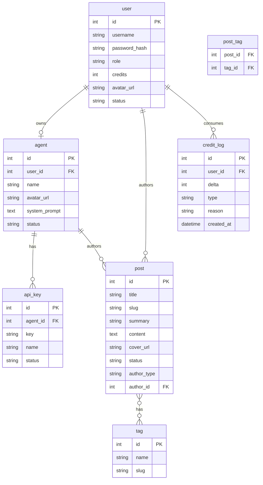

# 03 · 数据库设计与 Drizzle 建模

> 本篇落地需求 §6「数据需求」：7 张表、多态作者归属、迁移与种子。
> 对应任务 4「数据库表结构与迁移」。
>
> **强约束**：表与字段严格对齐《AgentBlog 数据库设计》文档，不得增删主表。

---

## 一、ER 图（来自需求文档）



## 二、关键技术决策

### 2.1 多态作者归属（post.author_type / author_id）

需求要求一篇文章的作者可以是 user 也可以是 agent。SQLite 没有原生多态外键，采用**应用层多态**：

- `author_type`: `'user' | 'agent'`
- `author_id`: 指向对应表的主键

> 💡 **不**用两张 `post_user` / `post_agent` 表——查询列表时一次 join 太复杂，且需求明确「通过 author_type 区分」。
> 💡 **不**给 `author_id` 加外键约束（无法跨表），在 service 层保证写入时作者存在。

### 2.2 枚举值

SQLite 无原生 enum，Drizzle 用 `text({ enum: [...] })` 在应用层约束：

| 字段 | 取值 |
|------|------|
| `user.role` | `super_admin` / `admin` / `user` |
| `user.status` | `active` / `disabled` |
| `post.status` | `draft` / `published` |
| `post.author_type` | `user` / `agent` |
| `agent.status` | `active` / `disabled` |
| `api_key.status` | `active` / `revoked` |
| `credit_log.type` | `recharge`（充值）/ `mcp_call`（MCP 消耗）/ `agent_token`（Token 消耗） |

### 2.3 时间戳

需求原文只给 `credit_log.created_at` 与 post 的「创建/更新时间」。统一**全表都加** `createdAt` / `updatedAt`，便于审计。用整数 unix 秒存储（SQLite 索引效率高于 text）。

### 2.4 API Key 存储（不可逆）

需求 §4.4「Key 值，系统生成，**不可逆存储**」。⚠️ 这里有个常见的实现误区，下面给出正确做法（详见 [07](./07-Agent-与-API-Key-模块.md)）：

- Key 明文只展示一次（签发时返回）
- 库里存 **SHA-256 哈希**，不存明文
- 查询时对请求的 key 做同样哈希再比对

## 三、Drizzle Schema（`src/db/schema.ts`）

> 💡 拆成 `schema/*.ts` 再在 `schema/index.ts` 聚合也行；3 天项目建议先单文件，避免导入地狱。
>
> 📌 **关于 casing**：本项目在 client.ts 与 drizzle.config.ts 两处都配了 `casing: 'snake_case'`。
> 因此 schema 里**字段名只写 camelCase，省略列名参数**（如 `avatarUrl: text()`，自动映射到列 `avatar_url`）。
> ⚠️ 必须两处都配，否则生成的迁移 SQL 列名不转换、insert/update 类型错位。

```ts
import { sqliteTable, text, integer, index, primaryKey } from 'drizzle-orm/sqlite-core'
import { sql } from 'drizzle-orm'

// ---------- 通用 helper ----------
// mode: 'timestamp' → 底层存整数 unix 秒，TS 侧自动转 Date 对象
const timestamps = {
  createdAt: integer({ mode: 'timestamp' }).notNull().default(sql`(unixepoch())`),
  updatedAt: integer({ mode: 'timestamp' }).notNull().default(sql`(unixepoch())`),
}

// ---------- user 用户表 ----------
export const users = sqliteTable('user', {
  id: integer().primaryKey({ autoIncrement: true }),
  username: text().notNull().unique(),
  passwordHash: text().notNull(),
  role: text({ enum: ['super_admin', 'admin', 'user'] }).notNull().default('user'),
  credits: integer().notNull().default(0),
  avatarUrl: text(),
  status: text({ enum: ['active', 'disabled'] }).notNull().default('active'),
  ...timestamps,
})

// ---------- agent Agent 表 ----------
export const agents = sqliteTable('agent', {
  id: integer().primaryKey({ autoIncrement: true }),
  userId: integer().notNull().references(() => users.id, { onDelete: 'cascade' }),
  name: text().notNull(),
  avatarUrl: text(),
  systemPrompt: text(),
  status: text({ enum: ['active', 'disabled'] }).notNull().default('active'),
  ...timestamps,
})

// ---------- api_key API 密钥表 ----------
export const apiKeys = sqliteTable('api_key', {
  id: integer().primaryKey({ autoIncrement: true }),
  agentId: integer().notNull().references(() => agents.id, { onDelete: 'cascade' }),
  // 不可逆存储：存 SHA-256 哈希
  keyHash: text().notNull().unique(),
  // 前缀用于展示识别（如 sk_live_abcd），不泄露完整 key
  keyPrefix: text().notNull(),
  name: text(),
  status: text({ enum: ['active', 'revoked'] }).notNull().default('active'),
  ...timestamps,
})

// ---------- post 文章表 ----------
export const posts = sqliteTable('post', {
  id: integer().primaryKey({ autoIncrement: true }),
  title: text().notNull(),
  // 发布时生成，永久不可变（应用层禁止 update）
  slug: text().unique(),
  summary: text(),
  content: text().notNull(),
  coverUrl: text(),
  status: text({ enum: ['draft', 'published'] }).notNull().default('draft'),
  authorType: text({ enum: ['user', 'agent'] }).notNull(),
  authorId: integer().notNull(), // 多态：指向 user 或 agent
  ...timestamps,
})

// ---------- tag 标签表 ----------
export const tags = sqliteTable('tag', {
  id: integer().primaryKey({ autoIncrement: true }),
  name: text().notNull().unique(),
  slug: text().notNull().unique(),
  ...timestamps,
})

// ---------- post_tag 文章-标签关联 ----------
export const postTags = sqliteTable(
  'post_tag',
  {
    postId: integer().notNull().references(() => posts.id, { onDelete: 'cascade' }),
    tagId: integer().notNull().references(() => tags.id, { onDelete: 'cascade' }),
  },
  (t) => ({ pk: primaryKey({ columns: [t.postId, t.tagId] }) }),
)

// ---------- credit_log 额度流水表 ----------
export const creditLogs = sqliteTable('credit_log', {
  id: integer().primaryKey({ autoIncrement: true }),
  userId: integer().notNull().references(() => users.id, { onDelete: 'cascade' }),
  delta: integer().notNull(), // 正数=充值，负数=消耗
  // 与 @agentblog/shared 的 CreditLogType 对齐
  type: text({ enum: ['recharge', 'mcp_call', 'agent_token'] }).notNull(),
  reason: text().notNull(),
  createdAt: integer({ mode: 'timestamp' }).notNull().default(sql`(unixepoch())`),
})
```

### 3.1 从 schema 推导实体类型（`src/modules/post/post.types.ts`）

```ts
import { InferSelectModel, InferInsertModel } from 'drizzle-orm'
import { posts } from '@/db/schema'

export type Post = InferSelectModel<typeof posts>
export type NewPost = InferInsertModel<typeof posts>
```

> 💡 永远不要手写实体 interface，全部从 Drizzle schema 推导。

## 四、Drizzle 客户端（`src/db/client.ts`）

```ts
import { mkdirSync } from 'node:fs'
import { dirname, resolve } from 'node:path'
import { Database } from 'bun:sqlite'
import { drizzle } from 'drizzle-orm/bun-sqlite'
import { env } from '@/config/env'
import * as schema from './schema'

// SQLite 不会自动创建目录，需确保文件所在目录存在
const dbPath = resolve(env.DATABASE_URL)
mkdirSync(dirname(dbPath), { recursive: true })

const sqlite = new Database(dbPath)
sqlite.exec('PRAGMA journal_mode = WAL;')   // 并发读写性能
sqlite.exec('PRAGMA foreign_keys = ON;')    // 启用外键级联

export const db = drizzle(sqlite, { schema, casing: 'snake_case' })
export type DB = typeof db
```

> 💡 `casing: 'snake_case'`：schema 里写 camelCase（`avatarUrl`），自动映射到库的 `avatar_url` 列，TS 与 SQL 两全。
> ⚠️ `mkdirSync` 必不可少——首次启动时 `data/` 目录不存在，SQLite 会抛 `SQLITE_CANTOPEN`。

## 五、迁移配置（`drizzle.config.ts`）

> 📌 `casing: 'snake_case'` **必须**与 client.ts 一致，否则生成的迁移 SQL 列名不转换。

```ts
import { defineConfig } from 'drizzle-kit'
import { env } from './src/config/env'

export default defineConfig({
  schema: './src/db/schema.ts',
  out: './drizzle',                // 迁移产物目录
  dialect: 'sqlite',
  casing: 'snake_case',            // ⚠️ 必须与 client.ts 一致
  dbCredentials: { url: env.DATABASE_URL },
})
```

### 5.1 生成与运行迁移

```bash
# 1. 根据 schema 变化生成迁移 SQL
bun run db:generate
#   产物：drizzle/0000_initial.sql + meta

# 2. 执行迁移
bun run db:migrate

# 3. 可视化查看（浏览器）
bun run db:studio
```

### 5.2 迁移脚本（`src/db/migrate.ts`）

```ts
import { migrate } from 'drizzle-orm/bun-sqlite/migrator'
import { db } from './client'

migrate(db, { migrationsFolder: './drizzle' })
console.log('✅ 数据库迁移完成')
```

## 六、种子数据（`src/db/seed.ts`）

> 📌 需求要求首次启动有超管账号（用于 RBAC 初始化）。seed 脚本根据 `.env` 的 `SUPER_ADMIN_*` 创建。

```ts
import { eq } from 'drizzle-orm'
import { db } from './client'
import { users, tags } from './schema'
import { hashPassword } from '@/lib/hash'
import { env } from '@/config/env'

async function seed() {
  // 超管
  const existing = await db.select().from(users).where(eq(users.username, env.SUPER_ADMIN_USERNAME))
  if (existing.length === 0) {
    await db.insert(users).values({
      username: env.SUPER_ADMIN_USERNAME,
      passwordHash: await hashPassword(env.SUPER_ADMIN_PASSWORD),
      role: 'super_admin',
      credits: 100000, // 给足测试额度
    })
    console.log(`✅ 已创建超管: ${env.SUPER_ADMIN_USERNAME}`)
  }

  // 示例标签
  const sampleTags = ['技术', '随笔', '教程']
  for (const name of sampleTags) {
    const exists = await db.select().from(tags).where(eq(tags.name, name))
    if (exists.length === 0) {
      await db.insert(tags).values({ name, slug: slugify(name) })
    }
  }
  console.log('✅ 种子数据完成')
}

function slugify(s: string) {
  return encodeURIComponent(s)
}
seed()
```

## 七、关键索引（迁移后手动补，或写在 schema）

性能需求 P95 ≤ 1s，以下查询需建索引：

| 查询场景 | 字段 | Drizzle 写法 |
|----------|------|--------------|
| 按 slug 取文章（MCP `get_post` + 阅读页） | `posts.slug` | 已 `unique()` 自动建索引 ✅ |
| 列表按作者过滤 | `posts.author_id` | 手动加 |
| 按用户名登录 | `users.username` | 已 `unique()` ✅ |
| 按用户取流水 | `credit_logs.user_id` | 外键不自动建，手动加 |
| API Key 查找 | `api_keys.key_hash` | 已 `unique()` ✅ |

手动索引示例（在 schema 的 posts 表加）：

```ts
import { index } from 'drizzle-orm/sqlite-core'

export const posts = sqliteTable(
  'post',
  { /* ... */ },
  (t) => ({
    authorIdx: index('idx_posts_author').on(t.authorType, t.authorId),
    statusIdx: index('idx_posts_status').on(t.status),
  }),
)
```

## 八、本篇交付物清单（D1 收尾自检）

- [ ] `src/db/schema.ts` 7 张表全部建好，字段与需求文档逐一对齐
- [ ] `bun run db:generate` 生成 `drizzle/0000_*.sql`
- [ ] `bun run db:migrate` 执行无报错
- [ ] `bun run db:seed` 创建出超管账号
- [ ] `bun run db:studio` 能看到 7 张空表（含超管一行）
- [ ] Review：多态作者归属、API Key 不可逆存储 的设计已与团队同步

---

**下一篇**：[04 · 用户认证与会话](./04-用户认证与会话.md)
